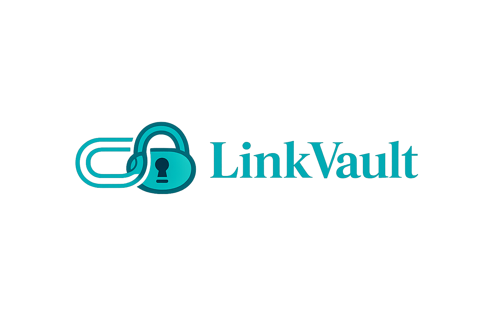

<div align="center">
  
  
  # LinkVault
  
  **Your digital bookmarking hub.**
  
  *Manage, organize, and quickly access your most important links and notes from a single dashboard.*
</div>

---

## 🚀 Features

- **Bookmarks Management:** Save, edit, and organize URLs. Pin your favorites or archive links you don't need immediately.
- **Notes System:** Integrated rich notes for jotting down thoughts alongside your saved links.
- **Categories:** Group links and notes into specific categories for easy discoverability.
- **Smart Filtering:** Quickly search and filter by category, favorites, or archived status.
- **Beautiful UI:** Built with React, Tailwind CSS, and Magic UI for a modern, responsive, and animated user experience.
- **Dark/Light Mode:** First-class support for system themes, seamlessly toggling with your OS preferences.

## 🛠️ Tech Stack

- **Framework:** React 19 + Vite
- **Styling:** Tailwind CSS, Shadcn UI
- **Animations:** Framer Motion, Magic UI (`<RainbowButton>`)
- **State & Data:** Zustand (State Management), Axios (API Client)
- **Routing:** React Router v7

## 📦 Getting Started

### Prerequisites
- Node.js (v18+)

### Installation

1. Clone the repository
   ```bash
   git clone https://github.com/your-username/linkvault.git
   cd linkvault
   ```

2. Install dependencies
   ```bash
   npm install
   ```

3. Start the development server
   ```bash
   npm run dev
   ```

## 🌐 API Integration
This frontend is configured to communicate with the LinkVault backend API (`https://linkvaultapi.runasp.net`). Ensure you have network connectivity to the API when authenticating and fetching resources.

## 🤝 Contributing
Contributions, issues, and feature requests are welcome!
